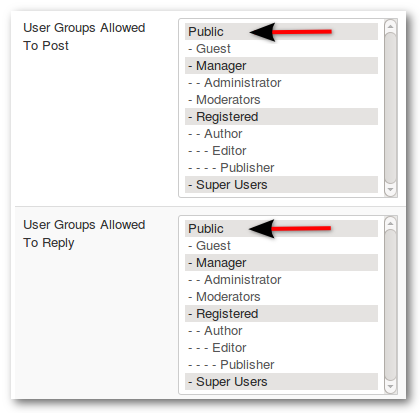

##### The default settings in Kunena are:

* Registered users can read and write
* Guests can read only

### Allow Guests to Post/Write

1) **_Kunena Configuration -> Security -> Security Settings -> Allow Guests to Post/Write = Yes_**
2) **_Categories -> Display Category -> (tab) Category Permissions -> Add "Public":_**
* User Groups Allowed To Post - Public
* User Groups Allowed To Reply - Public

It is recommended that, if you allow guests to post messages in your forum, you should use some form of spam defence or counter-measure; if you allow guests to post messages in your forum, it is suggested that you also set the value for the option [Display Captcha](../../faq/captcha-spam-protection).

##### Another option is Moderate Guests
* **_Kunena Configuration -> Security -> Security Settings -> Moderate Guests = Yes_**
Posts must be reviewed by moderators prior to publishing them in this category.