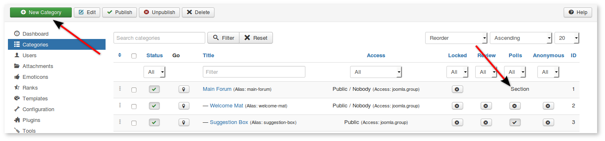
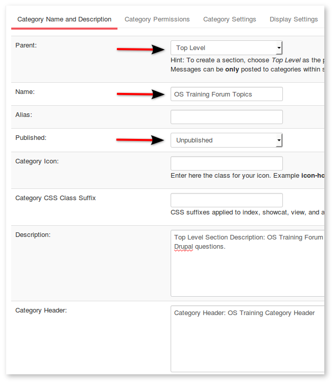
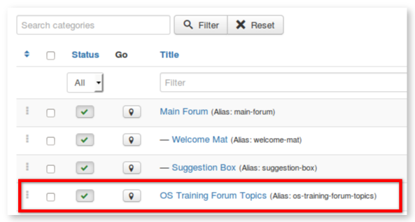
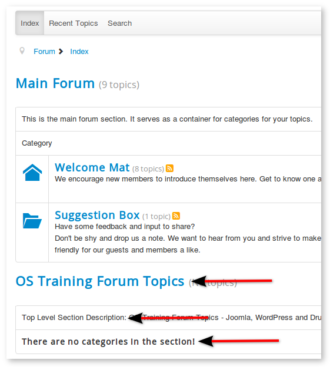
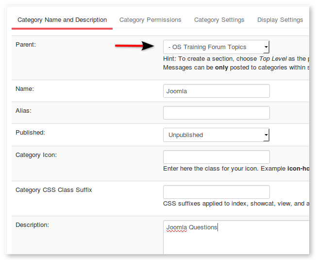
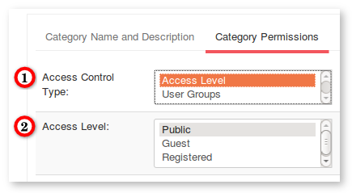
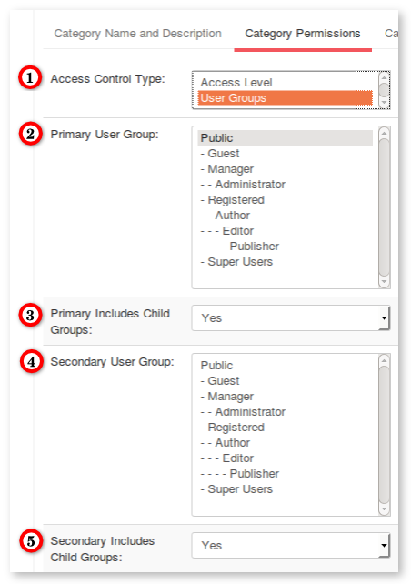
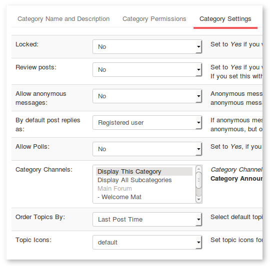
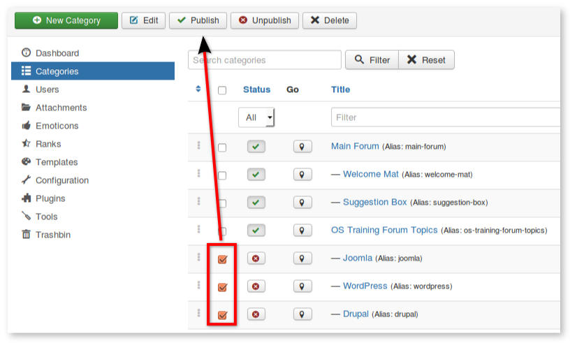
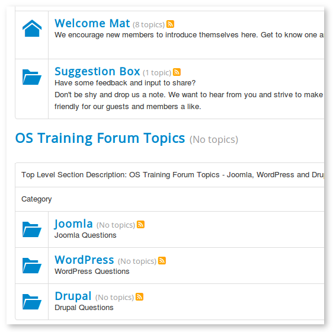

#### Introduction

In this tutorial will show you to how to setup sections and categories.

### Step 1: Organise Your Sections and Categories
Perhaps the most important way in which you will customize your forum will be the categories. These will be the areas that hold your members discussions.
It may seem a bit confusing, but first you need to create a **_section_** is really just a top level category. The sample categories in the image below show you how **_sections_** and **_categories_** are set up. The first line is the "Main Forum" and it is marked as a section.
A section is used as a header or divider for forum topics. You cant submit any posts to a section. You could add a topic to the "Main Forum" section, or you could create an entirely new section.
Lets create a new section so we learn the process from start to finish.

* Click **Categories**.
* Click **New Category**.

---

* Select _Parent_ Top Level
* Enter a _Name_ for your section
* Select _Published_ Published.
* _Description_ and _Header_ information are optional. You can decide if you want to use them after you see where they show up on the front end.
* Click **Save** at the top.
* Return to the main **Categories** page.
 

---

* Youll see a new section added to your category list on the backend:

---

* On the front end it will look like the image below.
* You can see the new sections _Name_ and _Description_ on the forum index page.
 

### Step 2: Create Categories

Now we need create the categories that will go in this section:

* Go to **_Components -> Kunena -> Categories_**.
* Click **New Category**.
* Select _Parent_ (the name of the section you created earlier).
* Fill in the remaining fields.
_For our example, were going to create three categories:_
* Joomla Questions
* WordPress Questions
* Drupal Questions

### Step 3. Define Permissions for Categories 

On many sites, there are particular forum categories that you want to restrict only for certain users. In Kunena you can do that by using Permissions.
Click the **Permssion** tab.
1) Access control type to be used in this category.
2) Access Level: The Access Level Group that is allowed to view this category.
For simple sites and memberships this may be adequate. If your site is more complicated, Choose "User Groups" on the dropdown and you will be presented with a new set of choices.

If you do choose _Access control type_ "User Groups", this will give you an entirely new set of choices. Only do this if you want more fine-grained control over permissions.

>>>>>> In the image below, **Public** means either everyone or only guests depending on the _Include Child Groups_ setting if you havent changed "Guest User Group" from **_Joomla -> Users -> User_**.

**Access control type** to be used in this category.
**Primary User Group**: The user group that is allowed to view this category. By default access is allowed to everyone who inherits the user group. Alternatively you can restrict access to the specified user group only by setting _Include Child Groups_ No.
**Primary Includes Child Groups:** _Should primary child groups be allowed access as well?_ If set to No, access to this category is restricted to the selected group only.
**Secondary User Group:** Secondary user group that is allowed to view this category. Secondary group can be useful for example if both Publishers and Managers need to be able to see the category. Hint: You can disable secondary group by setting it to have the same value as Primary User Group. Hint: It might be a better idea to create an Access Level Group instead of using Secondary User Group.
**Secondary Includes Child Groups:** _Should secondary child groups be allowed access as well?_ If set to No, access to this category is restricted to the selected group only.

### Step 4: Category Settings

Click the **Settings** tab:

**Locked:** Set to Yes if you want to lock this category. Nobody but forum moderators and site administrators can create new topics or replies in a locked category (or move posts to it).
**Review posts:** Set to Yes if you want posts to be reviewed by moderators prior to publishing them in this category. This is useful in a moderated categories only! If you set this without any moderators specified, the site administrator is solely responsible for approving/deleting submitted posts since these will be kept on hold!
**Allow anonymous messages:**     Anonymous messages can be used by registered users to post sensitive information to this category: No user related information will be stored with anonymous messages (including IP address).
**By default post replies as:**     If anonymous messages have been enabled, this option selects the default choice for the user. Regular users can later edit their own posts to be anonymous, but only moderators have the ability to edit anonymous posts.
**Allow Polls:** Set to Yes, if you would like to allow polls in this category.

### Step 5: Publish the categories

* Check the **Category Manager** page to see if everything is correct.
* Make sure the subcategories are indented.
* Make sure there is a green circle with a check in the published column. If not, click the red circle to change it to green.

### You've finished

If you need additional features for **Kunena**, you can also choose from a large number of extensions specifically built for **Kunena** on the [JED](http://extensions.joomla.org/extensions/).

###### This procedure first appeared at [www.ostraining.com](http://www.ostraining.com/blog/joomla/kunena/) and all credit for the text and images used here goes to the original author. This document has been slightly modified for use in this Wiki.