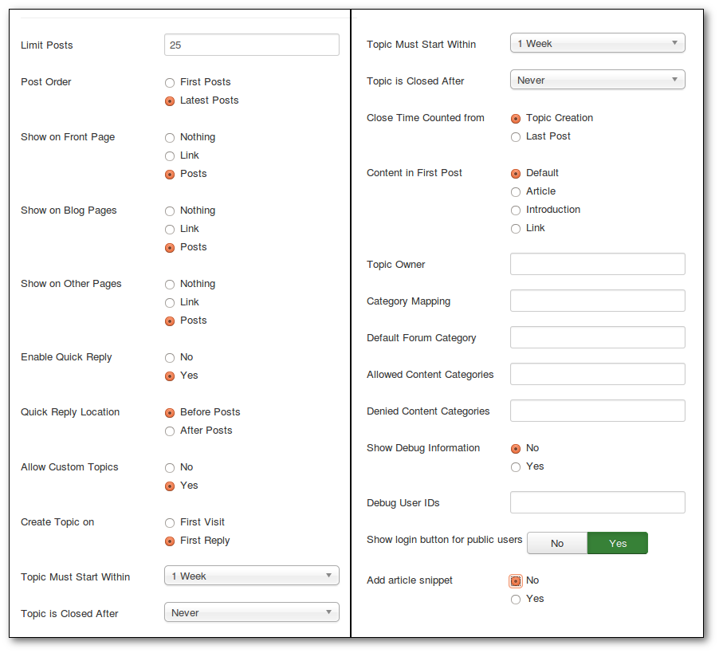
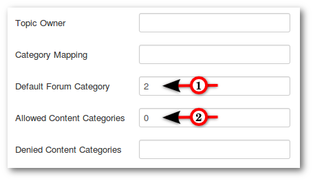
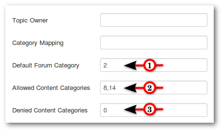
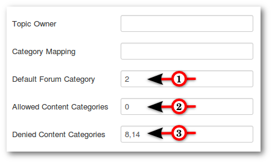
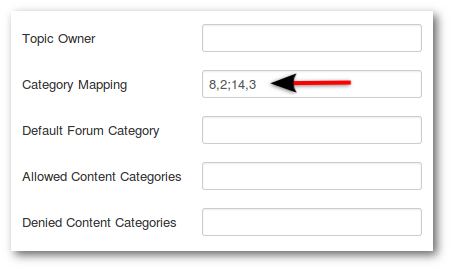

#### Introduction

Kunena Discuss is a separately installed add-on for the Kunena forum component for Joomla. The purpose of the extension is to allow users to comment or discuss Joomla articles. With Kunena Discuss you can selectively control which Joomla articles you want to allow your users to discuss on the forum, which forum category in which those discussions will occur, how long after the article was created to allow those discussions to happen as well as many other useful features. This tutorial will show you the main settings.

### Download and install

After [download](http://www.kunena.org/download) please go to your Extension Manager and install the package. Now navigate to your **Plugins** Manager under Extensions. Locate the Plug-in named **Content - Kunena Discuss** and click the red circle to enable it. After enabling it, click on the plugin name to set the parameters (shown on the picture side by side).

### Joomla to Kunena category mapping

#### First Example

1. Default Forum Category: All topics are created in Kunena category two
2. Enter a 0 to allow **all categories**: All new Joomla articles will automatically get a topic created in Kunena (depending on the setting either after the **First Reply** or **First Visit**).

#### Second Example

1. Default Forum Category: All topics are created in Kunena category two
2. Allowed Content Categories: Enter the category IDs. You must separate category IDs with a comma. All new Joomla articles in this categories will automatically get a topic created in Kunena (depending on the setting either after the **First Reply** or **First Visit**).
3. Enter a 0 to disable all categories except approved categories.

#### Third Example

1. Default Forum Category: All topics are created in Kunena category two
2. Enter a 0 to allow **all categories**. All new Joomla articles except denied categories will automatically get a topic created in Kunena (depending on the setting either after the **First Reply** or **First Visit**).
3. Denied Content Categories: Enter the category IDs. You must separate category IDs with a comma.

#### Fourth Example

Category Mapping with different Joomla and Kunena categories: Enter comma-delimited pairs of category IDs to map a Joomla category to a Kunena category. Using semi-colons to separate the pairs. If Joomla category 8 should create/map to topics in Kunena category 2 and Joomla category 14 should create/map to topics in Kunena category 3, enter 8,2;14,3; into the field using semi-colons to separate the pairs.

