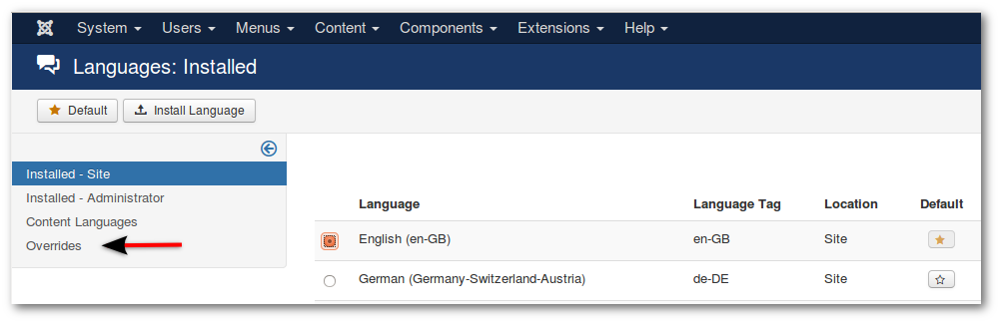
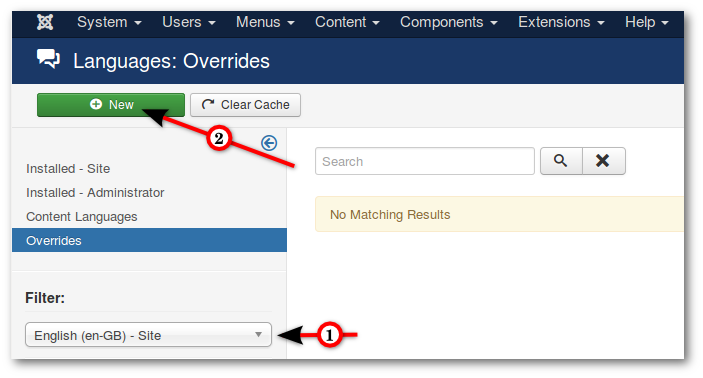
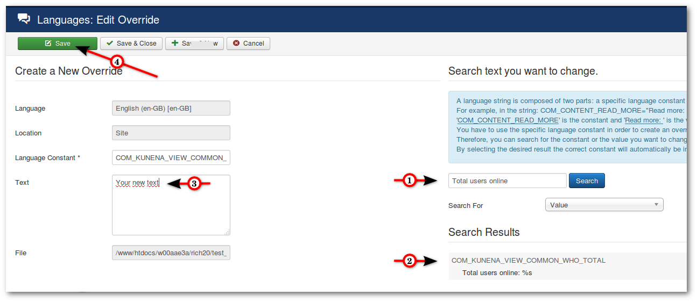

Sometimes it happens that you want to change a text passage or a word. Or it it will just a language key displayed (such as COM_KUNENA_PUBLISH). This can be easily changed, Joomla offers the feature of the language override.

### Overwrite text

* Go to **_Backend -> Extensions -> Language(s) -> Overrides_**

---

1. Select in the filter your language (and Site or Administrator)
2. Click **New**

---

1. Search the text passage
2. Click on search result (the result goes into the writing box left)
3. Change the text
4. Save

   
 >>>>>> If you know the language key, you can paste this code directly into the box Language Constant.