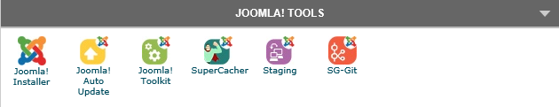
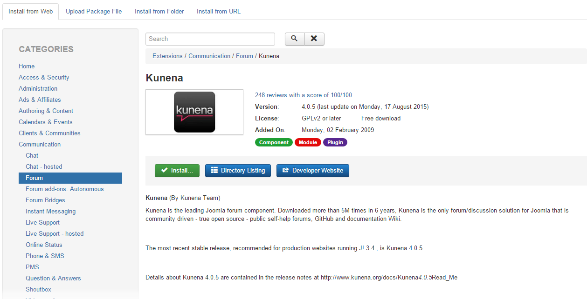




[SiteGround](http://www.siteground.com?afcode=c35a772207a64fd93e92cd5ba6c8109d)'s tag line is **Web Hosting Crafted With Care**, and it is for this reason it has proven a popular hosting solution for people in the Joomla and WordPress communities. It also makes a good option for hosting a Kunena-based web site.

In this guide we will cover the essentials for configuring a pretty bog-standard SiteGround shared hosting account to work optimally with Kunena.

## Picking your Hosting Plan

At the time of writing, SiteGround offers [three shared hosting options](http://www.siteground.com/web-hosting.htm?afcode=c35a772207a64fd93e92cd5ba6c8109d) ranging from low-end $3.95/month to $14.95/month for what they call the **GoGeek** plan. We strongly suggest going with the higher-end but still very cheap **GoGeek** plan. This provides better server hardware and less _user crowding_ on the server.

## Configuring PHP

SiteGround provides a very full-featured **cPanel** control panel. This is directly accessible via the **My Accounts** tab.

The first thing to do is to change the default version of PHP your site runs with.

On the main cPanel Home page, there is a section called **1H Software**.  Here you will find the **PHP Version Manager**. When you click this, you will be confronted with a folder tree where you can set a specific folder, or set the version site-wide by clicking `public_html`. When you choose a folder, you can select the version of PHP.  We strongly suggest picking the latest **PHP 5.5** version available.

Click save for this to take effect.

## Install Joomla

Siteground provides a simple click to install Joomla on your website.

## Install Kunena

After Installation You can install **Kunena** by useing the webinstaller, or by uploading the package.

