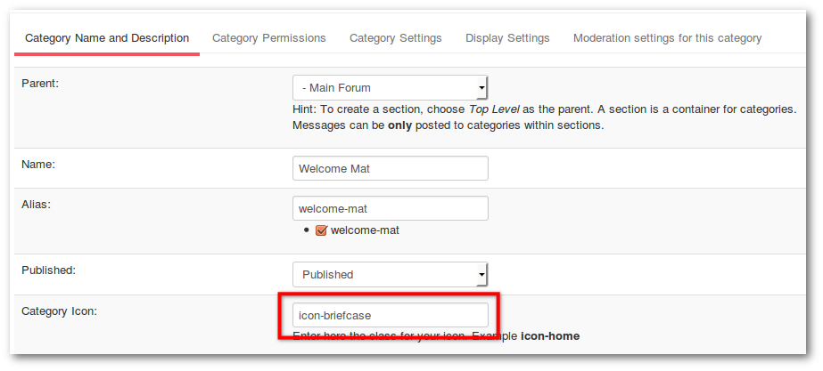
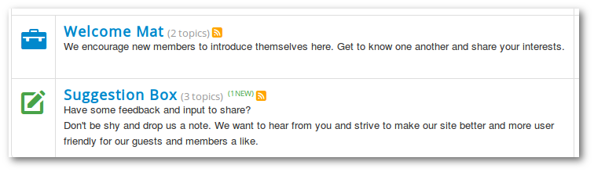
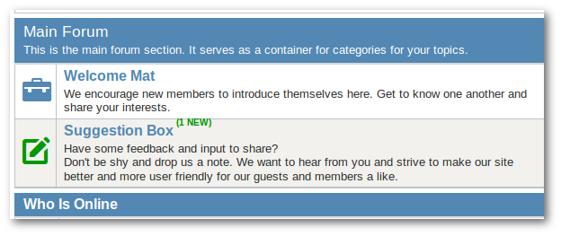

#### Different Category icons for different categories

If you are using a Joomla template which supported bootstrap icons, is it easy.

#### Example with template Protostar and Crypsis.

1. Go to **_Backend -> Kunena -> Categories_** and click on **_Category_**
2. Enter the name of icon in the category manager such as _icon-home, icon-trash_ etc.. ( [here is a list with this icons](http://help.joomla.fr/3/index.php/tutoriels/bootstrap/165-bootstrap-icones-de-la-police-icomoon-de-joomla-jui-j-3-2-0#h3-comparaison-des-icones-entre-joomla-3-1-5-et-3-2-0) ).





---

#### Example with template Protostar and Blue Eagle.

The same works also with Blue Eagle but it needs a little CSS customization.
1. Go in backend to **_Kunena -> Templates -> mark Blue Eagle -> Edit CSS -> custom.css -> Edit CSS_** and enter this codes:
    ```css
    #Kunena .icon-big {
        color: #5388b4;
        margin-right: 15px;
    }

    #Kunena .icon-knewchar, #Kunena .knewchar {
        color: #090 !important;
    }
    ```


2. Go to **_Backend -> Kunena -> Categories_** and click on **_Category_**
3. Enter the name of icon in the category manager such as _icon-home, icon-trash_ etc.. ( [here is a list with this icons](http://help.joomla.fr/3/index.php/tutoriels/bootstrap/165-bootstrap-icones-de-la-police-icomoon-de-joomla-jui-j-3-2-0#h3-comparaison-des-icones-entre-joomla-3-1-5-et-3-2-0) ).

---

#### If you want to use your own image.

###### Blue Eagle
1. Upload the image on the image dir on your kunena template.
example: components\com_kunena\template\blue_eagle\images\icons\gs.png
2. Go in backend to Kunena -> Templates -> mark Blue Eagle -> Edit CSS -> custom.css -> Edit CSS and enter this codes: 
  ```css
    #Kunena .icon-gs {
        background-image: url("../images/icons/gs.png");
        width: 16px;
        height:16px;
    }
    ```
3. Go to **_Backend -> Kunena -> Categories_** and click on **_Category_**
4. Enter the name of icon in the category manager icon-gs


###### Crypsis
1. Upload the image on the image dir on your kunena template.
example: media\kunena\category_icons\gs.png
2. Go in backend to Kunena -> Templates -> mark Crypsis-> Edit less -> custom.less -> Edit less and enter this codes: 
  ```css
    .icon-gs {
        background-image: url("category_icons/gs.png");
        background-repeat: no-repeat;
        width: 16px;
        height:16px;
    }
    ```
3. Go to **_Backend -> Kunena -> Categories_** and click on **_Category_**
4. Enter the name of icon in the category manager icon-gs
5. Clean Cache