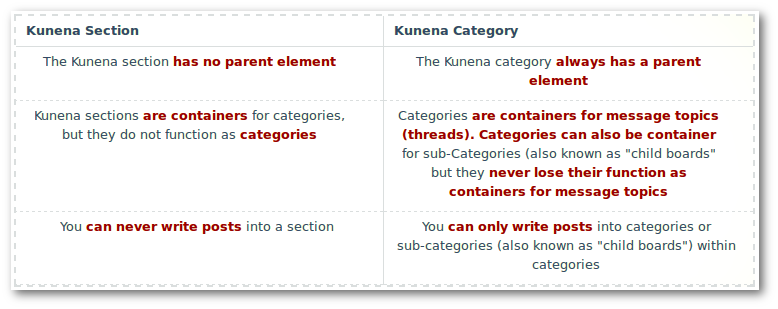

### Sections, Categories, Sub-Categories

#### Definitions

Kunena discussion topics (also called threads) are organised within categories and these categories are organised within sections. Before you can post create a new topic you must define a category for it and, before you can create a category, you must create a section.

### Categories

The categories of Kunena are not Joomla categories. One reason why Kunena categories are named categories is because the database contains a table of them, each record in the table has a unique Cat-ID. Every Kunena category has an own ID.
Discussion topics are created in categories. Discussion topics can also be moved between categories.

### Sections

Sections are actually just others, special, kinds of categories. The differences between sections and categories are shown in the following table:
                     

A Kunena section (Top Level) never has a parent element over itself. You can never write posts, or move topics, into a Kunena section.
Category and Forums hierarchy:
Kunena categories always have a parent element. This may be the Kunena section, but it can also be an existing category too. Of course this the parent category of a sub-category also has a parent element and so the hierarchy is as follows = Kunena Section (parent element) -> Category (child element of Section and parent element of sub-Categories) -> sub-Category (child element of Category). (See image)

Sometimes you will read about "child boards", but never forget: we are really only talking about sub-Categories of existing ones. You can only write posts into categories or sub-categories (or sub-categories of sub-categories), but never into Sections. 

### Create a new Section

**_Backend -> Components -> Kunena Forum -> Categories_**

* Click **New Category**
* Select _Parent_ Top Level
* Enter a _Name_ for your section
* Select _Published:_ Published
* _Description_ and _Header_ information are optional. You can decide if you want to use them after you see where they show up on the front end.
* Click **Save** at the top

### Create a new Category

The procedure is the same as [Create a new Section](../../../../manual/backend/categories/new-section-category#create-a-new-section). Only at the second point, there is a difference at _Parent_. Choose an existing section as the parent element from the drop-down list. See also [Sections & Categories](../../../../setup/sections-categories).

>>>>> The default setting for all new categories are: Registered Users can read and write, Guests only read. You can also edit existing categories using the Edit button (or simply click on the category link of the one you want to modify).