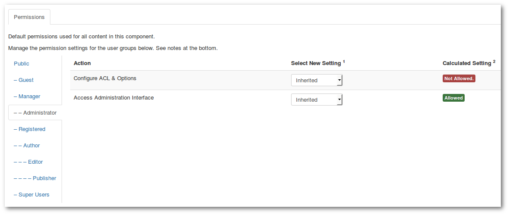

### ACL Kunena User Permissions

You find these settings in the **_Backend -> Components -> Kunena Forum -> Options_**

User Group **Super Users** has access to:
1. _Configure ACL & Options_
2. _Access Administration Interface_

User Group **Administrator** has access to: _Access Administration Interface_

All other user groups have **no access**!

>>>> These settings should not be changed! Unless, you want to create a own Administrator group only for Kunena (see [Admins only for Kunena](../../../../faq/admins-only-for-kunena)).

