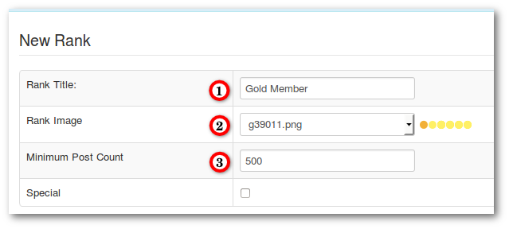
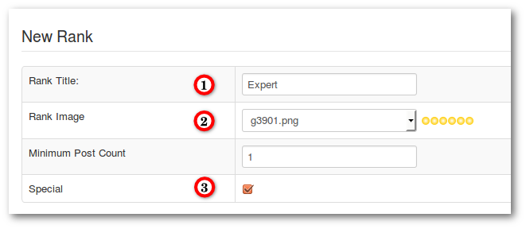

### Add new Rank and Rank image

#### Rank for Registered Users

##### Step 1

1. Create with an image editing program a rank image (default rank images are 70 x 16px)
2. Go to **_Backend -> Components -> Kunena Forum -> Ranks_**
3. Upload your New Rank Image
4. Click **New Rank**

##### Step 2

1. Enter a Rank Title
2. Select your Rank Image
3. Minimum Post Count (Number of posts which are required for this rank)
4. Save & Close

#### Rank for Special Users

##### Step 1

1. Create with an image editing program a rank image (default rank images are 70 x 16px)
2. Go to **_Backend -> Components -> Kunena Forum -> Ranks_**
3. Upload your New Rank Image
4. Click **New Rank**

##### Step 2

1. Enter a Rank Title
2. Select your Rank Image
3. Mark the check box **Special**
4. Save & Close

>>>>> A special rank must be assigned to users (see [Edit User](../,,/../../../backend/users/edit-user)).