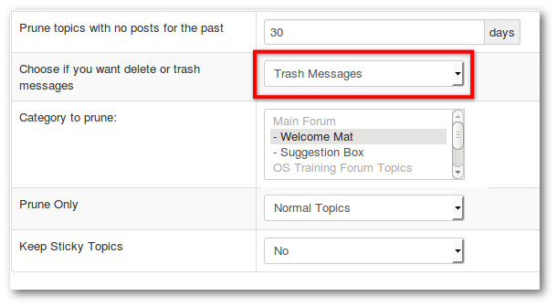

The Prune Categories function allows you to prune topics where there have not been any new posts during the specified number of days. Various settings are possible.

**_Backend -> Components -> Kunena Forum -> Tools -> Prune Categories_**

* Choose the desired settings
* Click **Prune**
* It is recommended **Trash Messages** because **Delete** removes the posts permanently.

