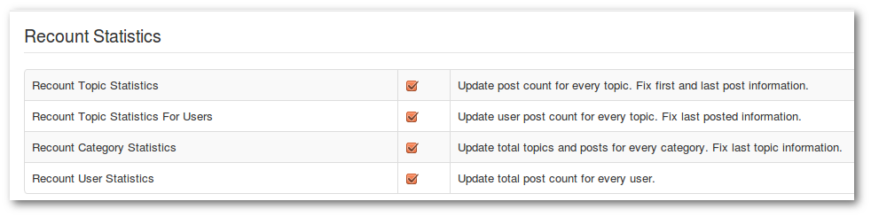

**_Backend -> Components -> Kunena Forum -> Tools -> Recount Statistics_**

If many posts have been deleted or moved, it can happen that the statistics (such as post numbers, number of pages..) are not correct. **Recount Statistics** fixes these problems.