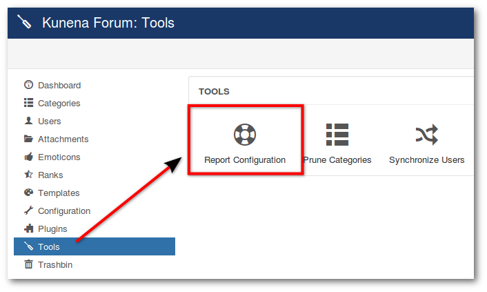
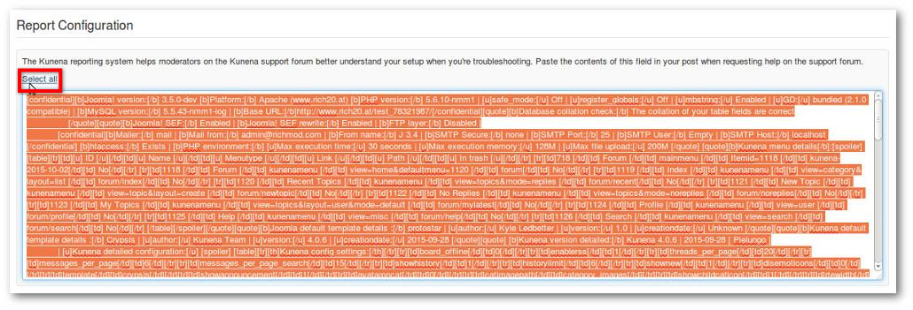

Report Configuration is a way to post a summary of your system and configuration settings. This will generate pre-formatted content with some BBCode to paste directly into a post at the Kunena.org forum.

#### Create Configuration Report

**_Backend -> Components -> Kunena Forum -> Tools -> Report Configuration_**

---

* Click on **Select all**
* Select all the generated text
* Copy it in your browser
* Paste to include that text in your post on the Kunena forum

This info will give us the details we need to help you with problems you might be having. Don't worry, any sensitive information is only visible by Kunena.org moderators.

>>>>> It's very important that you do NOT edit any of the information contained in this generated text.