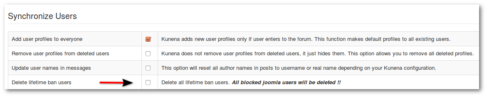

**_Backend -> Components -> Kunena Forum -> Tools -> Synchronize Users_**

* Add user profiles to everyone - Will automatically performed (is usually required if a forum has been migrated).
* Remove user profiles from deleted users - This option allows you to remove all deleted profiles.
* Update user names in messages - This option will reset all author names in posts.
* Delete lifetime ban users - **_Not recommended! All blocked joomla users will be deleted!_**