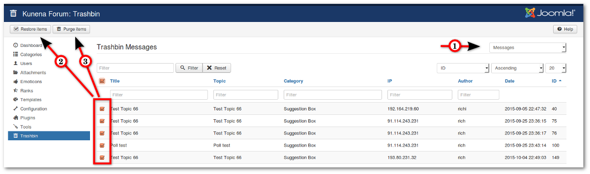

Posts which are deleted are moved to the trash and can be restored as needed.

**_Backend -> Components -> Kunena Forum -> Trashbin_**

There are three options:
1) Select Messages or Topics
2) Restore Items - Restores deleted posts / topics
3) Purge Items - Deletes permanently posts / topics (previously it will be shown the selected list)

>>>> Posts which are permanently deleted in the front end, will not be moves to the trash. Restore is not possible!