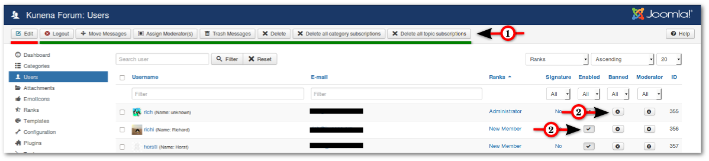

Here is the complete list of users. In addition there are some buttons for user editing.

#### Buttons above (1)

* **Edit** - Only a single user can be edited (see [Edit User](../../../manual/backend/users/edit-user)). With all other buttons you can edit multiple users at the same time.
* **Logout** - Force selected users to log out
* **Move Messages** - Move all messages from selected users to a defined category
* **Assign Moderators** - Assign selected users to be moderators
* **Trash Messages** - Move all messages from selected users to the trash
* **Delete** - Delete selected users
* **Delete all category subscriptions** - Delete all category subscriptions from selected users
* **Delete all topics subscriptions** - Delete all topics subscriptions from selected users

#### Small buttons (2)

* Ban/Unban User
* Enable/Disable User