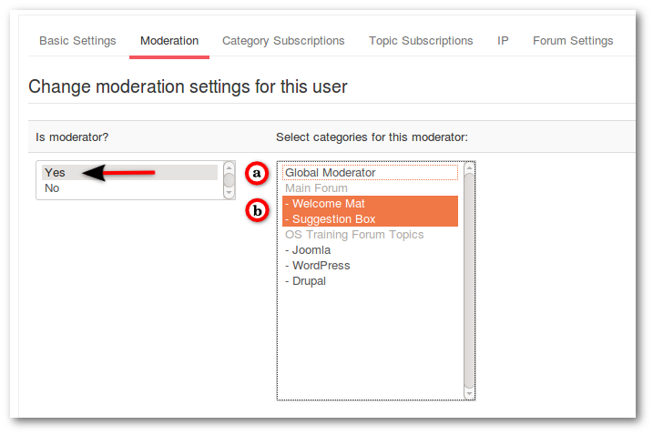
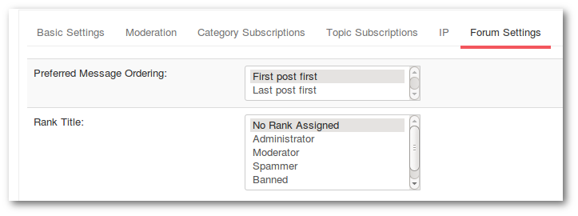

Go to **_Backend -> Components -> Kunena Forum -> Users_** and click on username.

##### Basic Settings

* You can remove the Avatar
* You can edit or remove the signature

##### Moderation

Select user as:
a - Global Moderator or
b - Category Moderator

##### Category Subscriptions - Topic Subscriptions - IP

These three tabs show only informations about it

##### Forum Settings

* Preferred Message Ordering: _First post first_ or _Last post first_
* Rank Title: All special ranks are listed here

>>>>> Here you can only select the rank title but no rights. The user receives only the rank title along with the rank image. Administrators and Moderators must no ranks be assigned. These automatically receive the rank.

