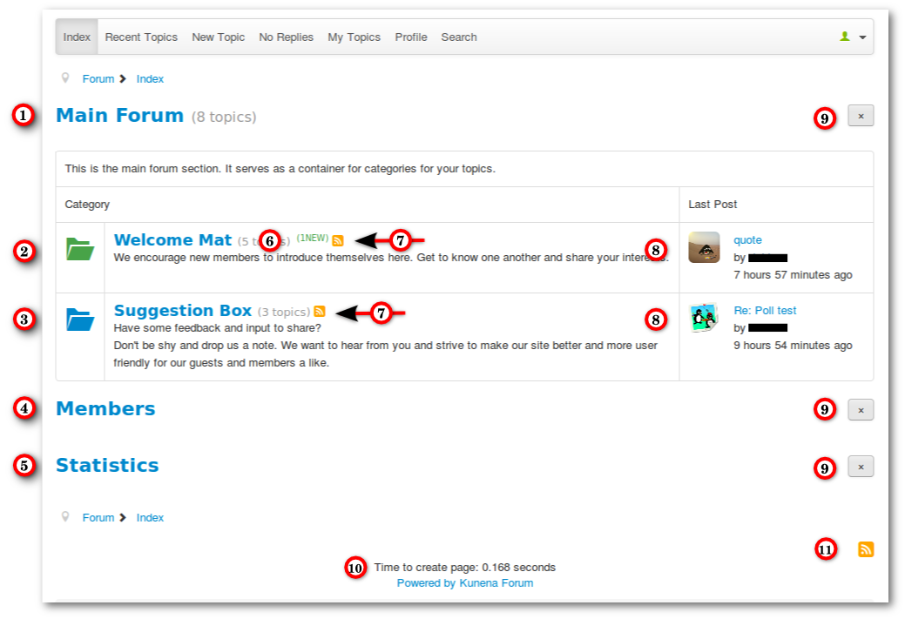

#### Introduction

The menu item Index provides an overview of the created sections and categories. This tutorial will show you a complete Index page with his features.

### Overview Index Page

1. Main Section - You can't create topics in a section. It serves as a container for categories (see [New Section/Category](../../../../manual/backend/categories/new-section-category)).
2. Category with unread topics (green folder)
3. Category contains no unread topics (blue folder)
4. Link to User List (can be disabled for guests)
5. Link to Statistics (can be disabled for guests and also completely be hidden for all users)
6. New indicator (green)
7. RSS Feed only for topics in this category
8. Avatars on index page can be enabled/disabled in the configuration (default value = disabled)
9. Hidden Toggler - (you see it if you drive over it with the mouse)
10. Displays page creation time - can be disabled
11. Global Kunena RSS Feed

