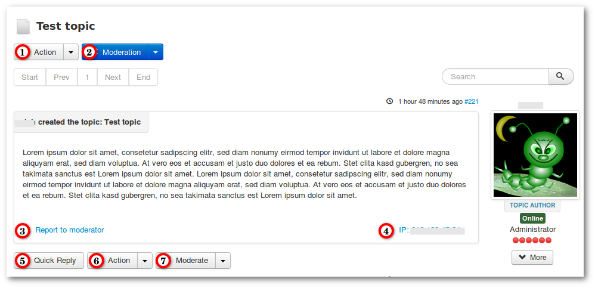

#### Introduction

This tutorial will show you a message with his features.

### Overview

1. **Action** - this dropdown menu contains:
   a. Reply Topic
   b. Subscription - subscribe this topic
   c. Favorite - mark this topic as favorite
2. **Moderation** - this dropdown menu contains options only for moderators:
   a. Delete Topic - delete the complete topic
   b. Moderate Topic (see [Moderate](../../new-topic/moderate))
   c. Sticky - mark this topic as sticky
   d. Lock/Unlock - lock this topic for users (moderators can continue to write in this topic)
3. Report to moderator - offensive messages can be reported (moderators get a mail)
4. Show user IP - these option is only available for Admins and Moderators
5. Quick Reply
6. **Action** - this dropdown menu contains:
   a. Reply
   b. Quote
   c. Edit
7. **Moderate** - this dropdown menu contains options only for moderators:
   a. Moderate Message (see [Moderate](../../new-topic/moderate))
   b. Delete - delete this message
   
   