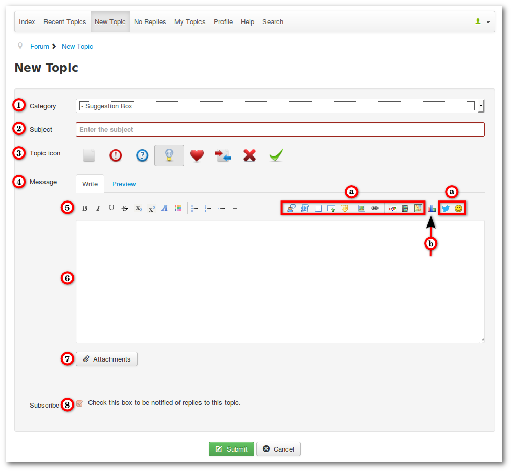

### Create a new topic

1. Choose the correct category. When a user selects no category, the topic will created in the first category. The first category is selected as default. But it's possible force users to pickup a category ([Configuration -> Frontend](../../../../manual/backend/configuration/frontend)).
2. Enter a informative topic title
3. Choose a topic icon (optional). Only topic authors or moderators can choose or to change topic icons.
4. Tabs to switch between write or preview mode
5. BBCode bar
   a. These BBCode icons can be disabled ([Configuration -> BBCode](../../../../manual/backend/configuration/bbcode) or [Template Settings](../../../../manual/backend/templates/edit-template-settings)).
   b. This icon is only available for categories with polls.
6. Text Field
7. Attachments (this button opens a option to add attachments).
8. Check this box if you want subscribe this topic. Uncheck this box if you want no subscription (you can choose this options global in the [profile](../../../../manual/frontend/crypsis/profile)).

