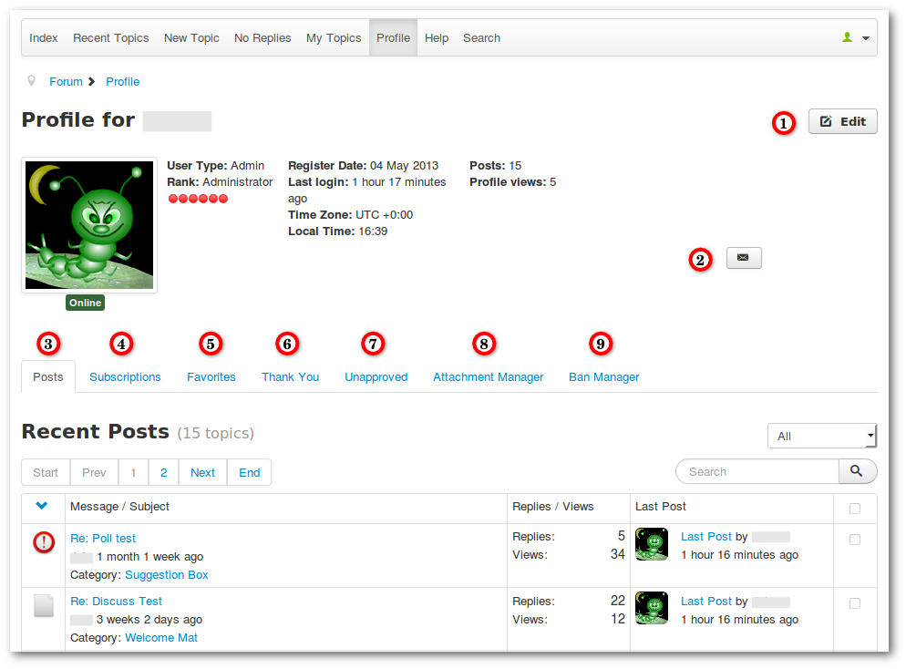
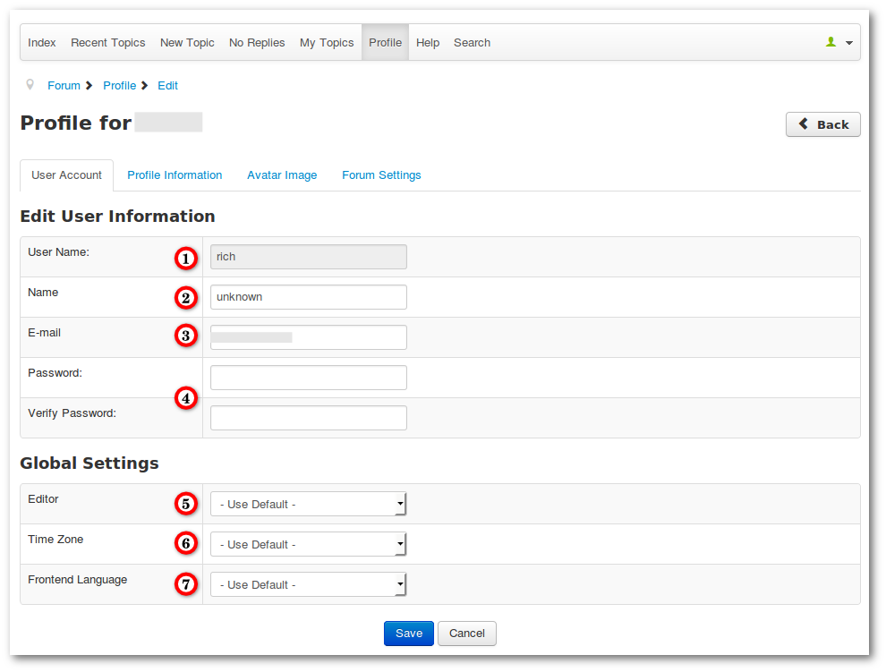
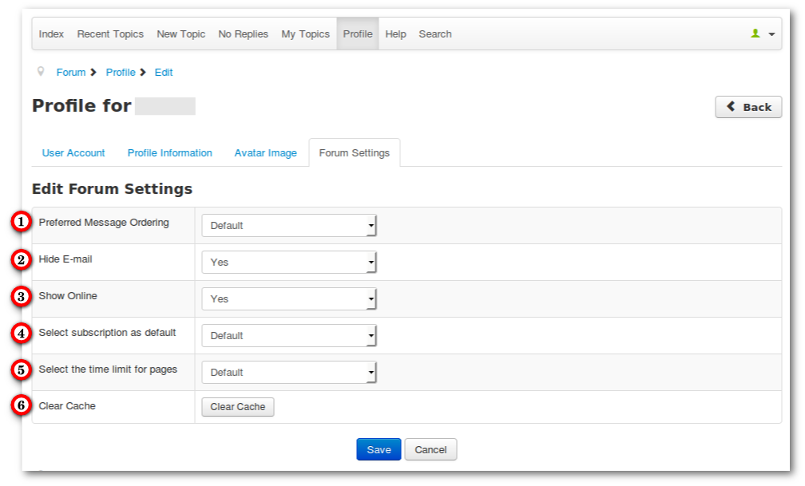

#### Introduction

This menu item goes to your personal profile. This tutorial will show you a complete profile page with his features.

### Overview Profile Page

1. The edit button goes to the profile settings
2. Your email address - other users can see it only if you allow it (see [Edit Profile - Forum Settings](../profile#forum-settings))
3. Tab Posts - shows your own posts
4. Tab Subscribtions - shows your subscriptions (with options to unsubscribe your topics and category subscriptions)
5. Tab Favorites - shows your favorites (with option to unfavorite)
6. Tab Thank You - shows _Given Thank You_ and _Received Thank You_
7. Tab Unapproved **only for moderators** - shows unapproved posts
8. Attachment Manager - own attachments can be deleted
9. Ban Manager **only for moderators** - shows banned users

### Edit Profile

#### User Account

1. User Name - Username can't be changed unless the administrator allowed it _(Backend -> Users -> Manage -> Options -> Change Login Name = Yes)_.
2. Your Real Name
3. Your E-mail - can be changed
4. Password change
5. Editor - This setting has no effect
6. Time Zone - Choose your time zone
7. Frontend Language - Changing is only possible when others languages are installed

#### Profile Information

Various information can be entered here (such as Birthdate, Location etc..). All options are optional.

#### Avatar Image

Users can upload their own avatars.

#### Forum Settings

1. Message Ordering - Possible is _First post first_ (default) and _Last post first_
2. Hide E-mail - When is set _Yes_, other users cannot see the address
3. Show Online - When is set _No_, you are offline for other users
4. Select subscription as default - Choose default subscription _Yes_ or _No_ regardless of the general setting.
5. Select the time period for Recent Topics, My Topics, etc..
6. Clear Cache - Empties your profile cache

