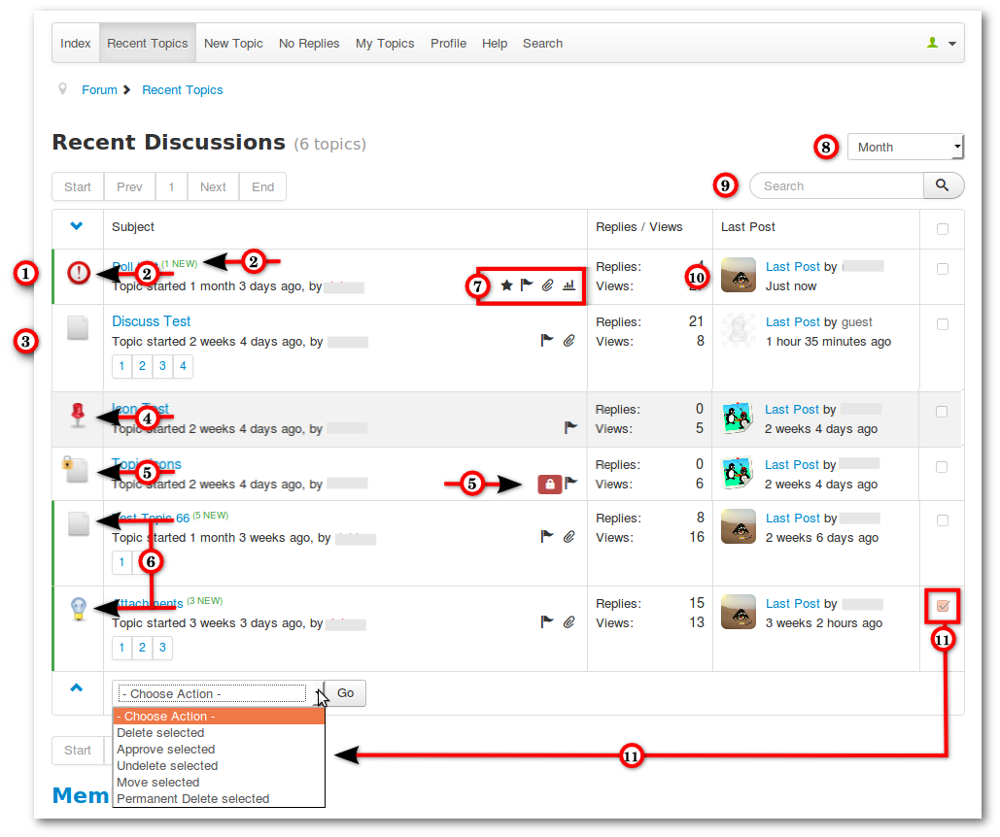

#### Introduction

The menu item Recent Topics shows a list of current topics by selected categories (default setting shows all categories). This tutorial will show you a complete Recent Topics page with his features.

### Overview Recent Topics Page

1. Topic with unread messages
2. Click on New indicator or Topic Icon goes to the first unread message
3. Topic includes no unread messages
4. Sticky Topic (**only Admins and Moderators can mark topics than sticky**)
5. Topic is closed (**only Admins and Moderators can close a topic**)
6. Topic Icon (topic author can choose it)
7. Topic Symbols (from left to right)
  a. Topic is marked as my favorite
  b. Topic contains my posts
  c. Topic contains attachments
  d. Topic contains a poll
8. Time period for recent topics
9. Quick search in topics
10. Avatars on recent topics page can be enabled/disabled in the configuration (default value = disabled)
11. **These option is only available for Admins and Moderators**
  a. selected topics can be deleted
  b. selected topics can be undeleted
  c. selected topics can be permanently deleted
  d. selected topics can be approved
  e. selected topics can be moved
  
  