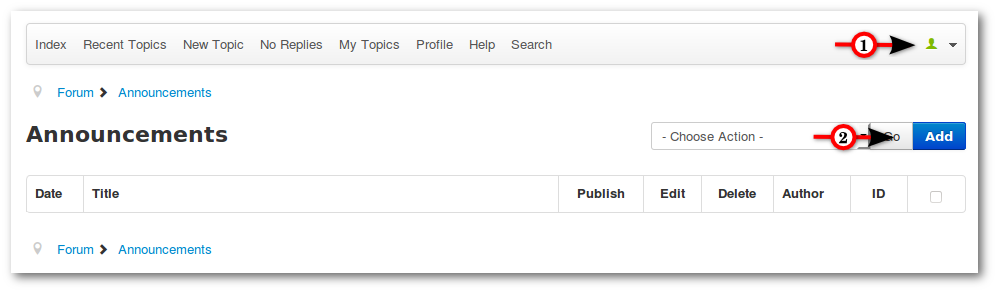
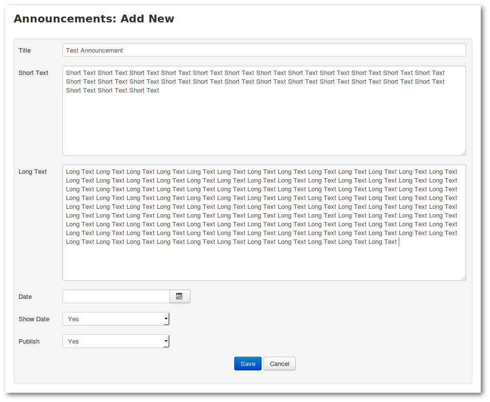
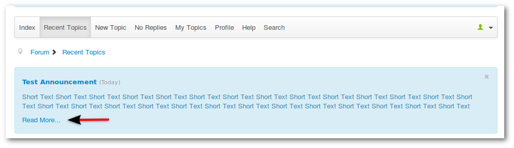
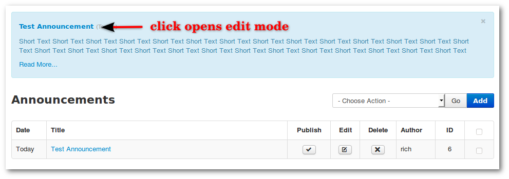

Announcements must be enabled in the Kunena configuration. Only admins and global moderators can create announcements.
**_Backend -> Components -> Kunena Forum -> Configuration -> Frontend -> Look and Feel: Show Announcement = Yes_** (default).

### Add Announcement

#### Step 1

1. Open the profile box on top and click **Announcement**
2. Click **Add** (it opens a new window)

#### Step 2

1. Enter **Title**
2. Enter **Short Text**
3. Enter **Long Text** (optional)
4. Enter **Date** (start time - optional)
5. Show Date (optional)
6. Publish **Yes**
7. Save

The announcement is published now and the short text will appear above. Click on **Read More** shows _Short_ and _Long Text_.

---

### Edit Announcement

There are three options. Click on the Announcement (or **_profile box -> announcement_**) and you will see it.
1. Publish / Unpublish
2. Edit (edit text)
3. Delete

