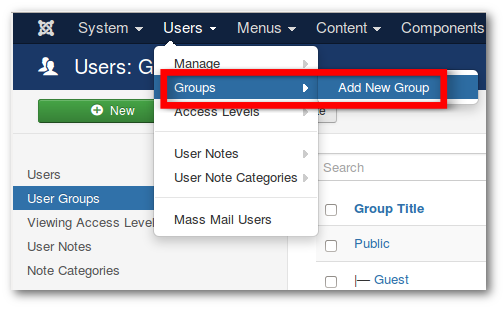
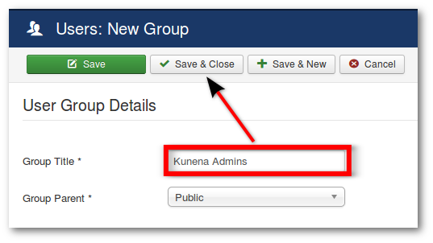
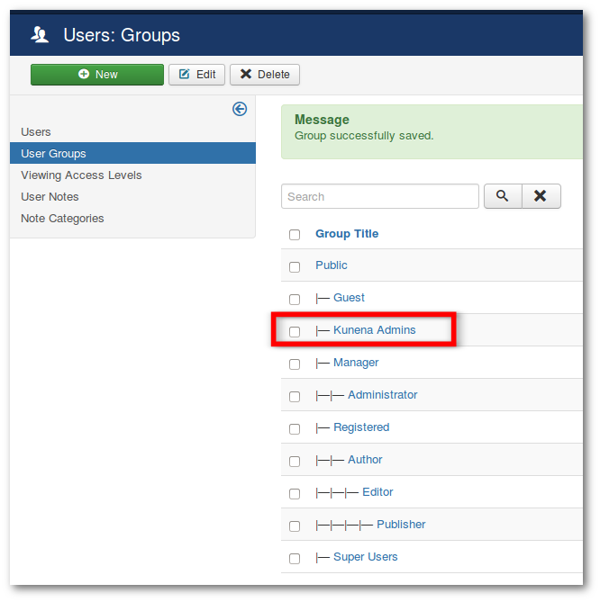
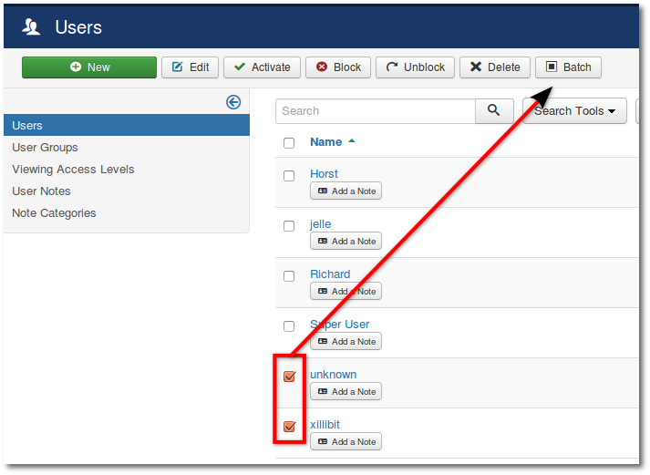
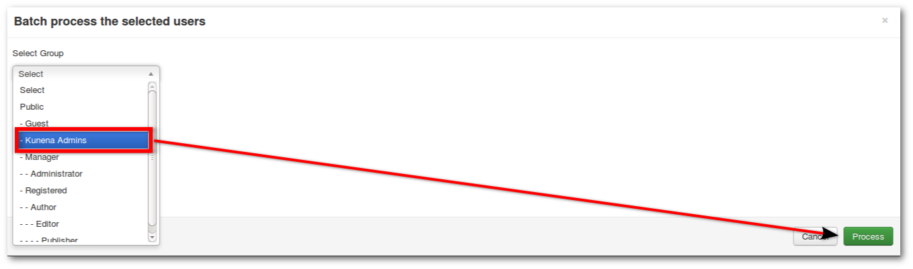
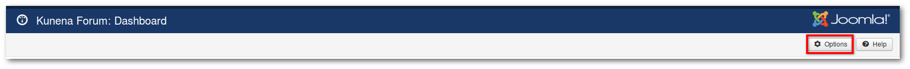
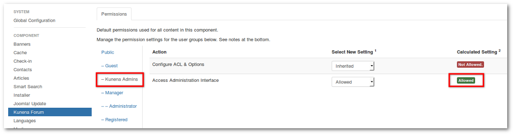
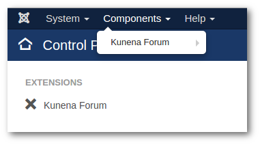

#### Introduction

This tutorial will show you to how to create administrators only for Kunena.

>>>> Important! Create a database backup before. There is no reset option in Joomla to undo it if incorrect permissions are set.

### Step 1: Add New User Group

**_Backend -> Users -> Groups -> Add New Group_**

### Step 2: Group Title

Now you'll see a new window User Group Details.
* Enter a Group Title
* Click **Save & Close**

The new Group has been created.

### Step 3: Add Users to the Group

* Go back to the user management
* Mark your desired users
* Use the Batch function

* Select User Group
* Click **Process**

### Step 4: Permission Setting for this Group

* **_Global Configuration -> (Tab) Permissions_**
* Site Login - **Allowed**
* Administrator Login - **Allowed**
* Offline Access - **Allowed** 
* Save & Close

### Step 5: Permission Setting for Kunena

* Go to **_Kunena Dashboard -> Options_**

* Select - (tab) Kunena Admins
* Access Administration Interface - **Allowed**
* Save & Close

If everything was done correctly. then have Kunena Admins backend access but no access to Joomla features.

