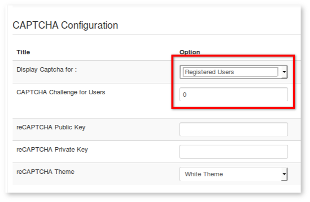
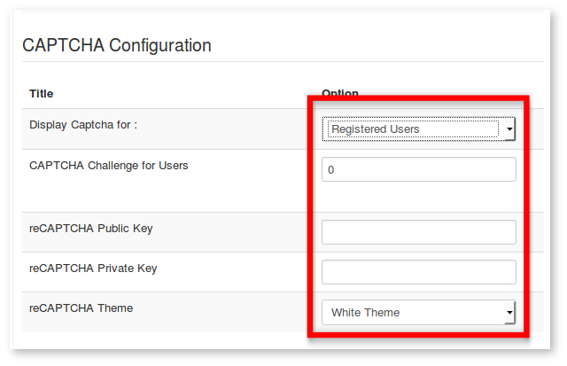

### Introduction

There is no perfect **_total_** solution to completely eliminate spam from any discussion forum anywhere. The only truly effective remedy against spam is vigilance.
**Kunena** discourages spam messages appearing in your forum by using [CAPTCHA](https://en.wikipedia.org/wiki/CAPTCHA).

#### Setup Crypsis and HMVC templates:

You need to configure the Joomla captcha plugin in order to make captcha to work. You have only two settings in **_Forum Configuration -> Security -> CAPTCHA Configuration panel_** which can be used:

**Display Captcha for:** _Nobody, Registered Users_ or _Guest Users and Registered Users_
**CAPTCHA Challenge for Users:** Enter a number of posts

**CAPTCHA Challenge for Guests:** Value = **_Guest Users And Registered Users_**. This setting applies to all guests who may post in your forum and this setting is unaffected by the value of _CAPTCHA Challenge for Users_. The setting _CAPTCHA Challenge for Guests_ only has practical value if the following condition is true:
**_Forum Configuration -> Security -> Security Settings -> Allow Guests to Post/Write = Yes_**
It is recommended that, if you allow guests to post messages in your forum, you should use **_some_** form of spam defence or counter-measure; if you allow guests to post messages in your forum, it is suggested that you also set the value for the option _Display Captcha for: Guest Users And Registered Users_.

**CAPTCHA Challenge for Users** Value = **_Registered Users_** or **_Guest Users And Registered Users_**. Setting this to a non-zero value will require all registered users of your forum to use CAPTCHA until the number of messages they have posted on your forum exceeds the number specified. You should use your discretion in choosing a practical value for your particular circumstances. Generally, a value of 3 or 4 is considered appropriate for most situations. Setting the value to zero disables CAPTCHA for registered users. This setting has no effect on site administrators or forum moderators who are never required to respond to a CAPTCHA challenge on the forum.

---

#### Setup Blue Eagle and legacy templates:

There are five settings:

**CAPTCHA Challenge for Guests:** Value = **_Guest Users And Registered Users_**. This setting applies to all guests who may post in your forum and this setting is unaffected by the value of _CAPTCHA Challenge for Users_. The setting _CAPTCHA Challenge for Guests_ only has practical value if the following condition is true:
**_Forum Configuration -> Security -> Security Settings -> Allow Guests to Post/Write = Yes_**
It is recommended that, if you allow guests to post messages in your forum, you should use **_some_** form of spam defence or counter-measure; if you allow guests to post messages in your forum, it is suggested that you also set the value for the option _Display Captcha for: Guest Users And Registered Users_.

**CAPTCHA Challenge for Users:** Setting this to a non-zero value will require all registered users of your forum to use CAPTCHA until the number of messages they have posted on your forum exceeds the number specified.  You should use your discretion in choosing a practical value for your particular circumstances.  Generally, a value of 3 or 4 is considered appropriate for most situations. Setting the value to zero disables CAPTCHA for registered users.  This setting has no effect on site administrators or forum moderators who are never required to respond to a CAPTCHA challenge on the forum.
**reCAPTCHA Public Key:**  This is obtained by [signing up](https://www.google.com/recaptcha/admin/create) to _reCAPTCHA_.
**reCAPTCHA Private Key:**  This is obtained by [signing up](https://www.google.com/recaptcha/admin/create) to _reCAPTCHA_.
**reCAPTCHA Theme:**  Differently coloured themes for the display of the CAPTCHA form (red, white, black or clean).

