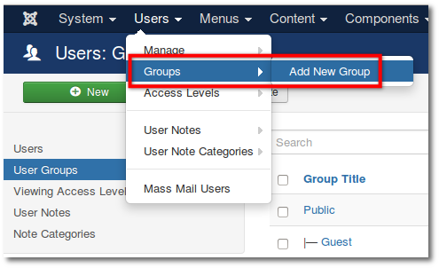
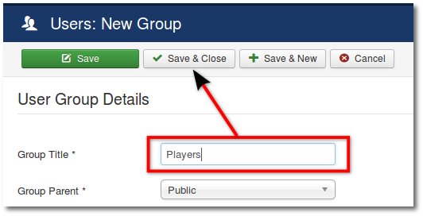
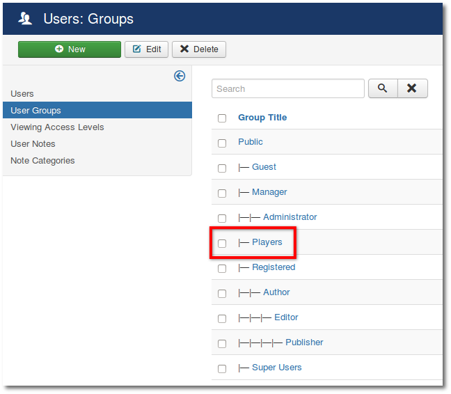
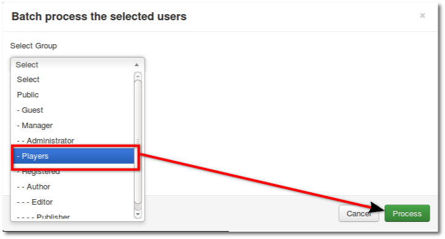
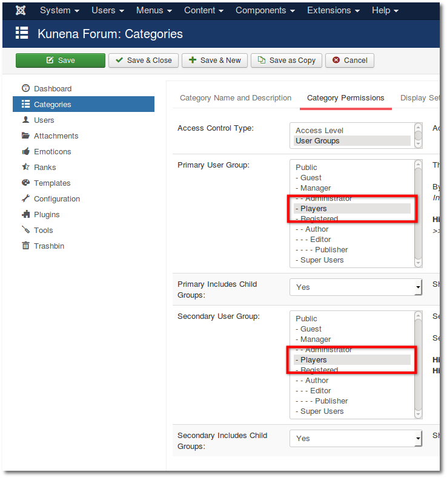

#### Introduction

This tutorial will show you to how to create a forum only for certain user groups.

### Step 1: Add New User Group

**_Backend -> Users -> Groups -> Add New Group_**

### Step 2: Group Title

Now you'll see a new window User Group Details.
* Enter a Group Title
* Click **Save & Close**

The new Group has been created.

### Step 3: Add Users to the Group

* Go back to the user management
* Mark all your certain users
* Use the Batch function

* Select User Group
* Click **Process**

#### Step 4: Category Permissions

In conclusion only the category permissions need to be set (see also [Sections & Categories](../../setup/sections-categories)).
**_Backend -> Kunena -> Categories ->_** Click on **_Category_**

* Select tab **Category Permissions**
* Primary User Group: - **Your new group**
* Secondary User Group: - **Your new group**

>>>>> This setting is needed in all sections and categories which are exclusive to this group.