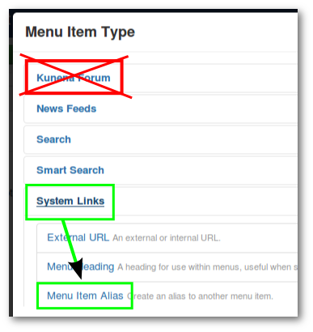

The Kunena menu is a set of tabs that appears across the top of the forum pages. In some cases, this menu does not appear for a variety of causes. This error often occours by incorrectly created menu items, or if menu items where moved from the Kunena menu to other menus (example: in the main, top and so on).

>>>>> Links of other menus, which are linked to the forum, must be Menu Item Type = **Menu Item Alias** (see the image). Wrongly-configured menu items can be easily fixed but trashed menu items can still cause problems. It is preferable to delete all unneeded menus from the trash.

### Solutions
#### Repairing wrongly-configured menu items

If you suspect that your main site menu items are wrongly configure (and the Kunena menu is unchanged) then edit these menu items (example: main, top) and change the Menu Item Type to **Menu Item Alias**.

#### If Kunena menu items have been moved to other menus

To ensure that the Kunena menu is complete again, navigate to the Kunena Dashboard to **_Tools > Menu Manager_**, then click on the top of right, on the icon **Restore Kunena Menu**. Following navigate to the relavant menus (example: main, top) and change the Menu Item Type of the links, which are linked to the forum, to **Menu Item Alias**.

#### Create a completely new Kunena Menu

A simple remedy for the problem is to use the trash-burn-build technique:
1. Trash all existing menus and menu items that relate to your Kunena forum.
2. Empty the menu trash.
3. Use the Kunena Dashboard: **_Tools -> Menu Manager -> Restore Kunena Menu_** facility.
4. Publish the menu item created for you in your top-level/main menu.